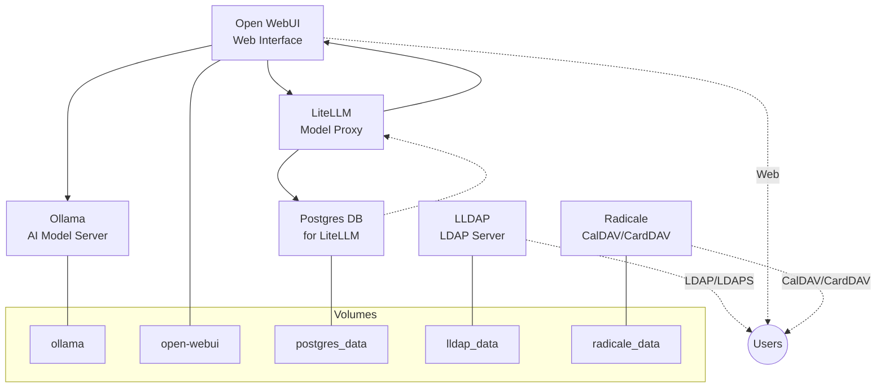

# Architecture

This page describes the architecture of the system and visualizes the main services using a Mermaid diagram.

---

## System Overview

The system is composed of several services orchestrated via Docker Compose. These services provide authentication, AI model serving, web UI, proxying, database, and calendar functionalities.

---

## Services Diagram

---

## Service Descriptions

- **lldap**: Lightweight LDAP server for authentication, with web frontend.
- **ollama**: AI model server, provides LLM inference.
- **open-webui**: Web interface for interacting with LLMs and proxies.
- **litellm**: Proxy for LLMs, supports model management and connects to a Postgres database.
- **litellm_postgres_db**: PostgreSQL database for LiteLLM proxy.
- **radicale**: CalDAV/CardDAV server for calendar and contact data.

---

## Data Persistence

All major services use Docker volumes for persistent storage:
- ollama, open-webui, postgres_data, lldap_data, radicale_data

---

## Networking

- Services communicate over Docker's internal network.
- Only selected ports are exposed to the host for web access and LDAP/CalDAV protocols.

---

## Dependencies

- open-webui depends on ollama and litellm
- litellm depends on litellm_postgres_db

---

This architecture allows modular, scalable, and secure deployment of AI, authentication, and calendar services.
